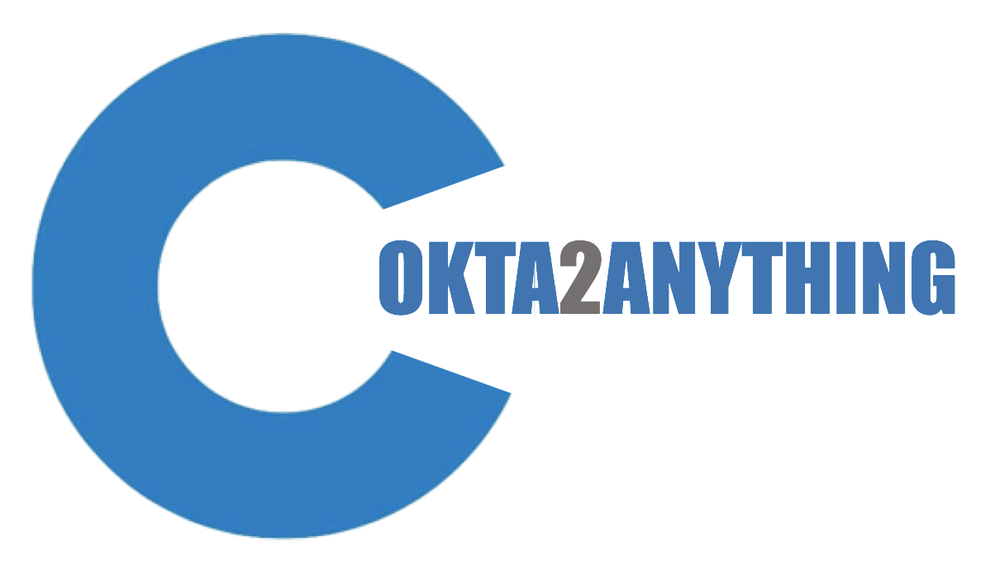

### Description

Okta2Anything is a simple LDAP Proxy which allows someone to have the Okta
IDAAS Service authenticate against almost anything.

This code is based on the great work by: https://github.com/vjeantet/ldapserver

### *Disclaimer*

*Although it is not uncommon for companies to use LDAP Proxies for authentication, this code is developed for Pilots, Proof of Concepts, and testing.*
*Anyone using this code for production is doing os at thier own risk*

### How does it work ?

Okta2Anything acts like an LDAP Service. Using the Okta LDAP Agent, and pointing
the LDAP Agent to Okta2Anything. Okta2Antyhing will delete the authentication
to a local node.js script that will perform the Authentication

### Configuration

#### Prerequisites

An Okta LDAP Agent is required, and node.js and any required artifacts needed for
your authentication scripts to run need to be installed.

You will need to download the binary for the Operating System you are running on

|  OS |  Download Link |   
|---|---|
|   | [Linux](https://github.com/pmcdowell-okta/okta2anything/raw/master/okta2anything.linux)  |   
|   | [MacOS](https://github.com/pmcdowell-okta/okta2anything/raw/master/okta2anything.linux)|   
| | [Windows](https://github.com/pmcdowell-okta/okta2anything/raw/master/okta2anything.linux)  |   

#### Configuring you Okta LDAP Agent

Follow Okta's guides for configuring LDAP, an example of the settings for the LDAP Agent 
that are compatible for Okta2Anything are available here

["LDAP Configuration"](./images/page1.pdf)

["Import Settings"](./images/page2.pdf)

#### Running the LDAP Proxy

``./okta2anything``

Command line Switches:

| switch  |  Description |
|---|---|
|  -w |  Set Password for cn=Directory manager (If not specified, anything is accepted)  |
|  -plugin |  Specify Plugin used for Authentication (node.js Script) |

Okta2anything defaults to Port 389