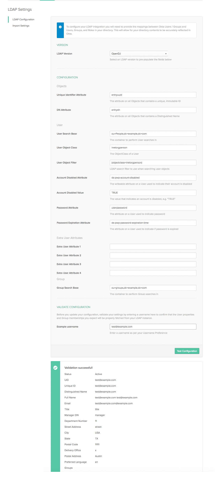

### Description

Okta2Anything is a simple LDAP Proxy which allows someone to have the Okta
IDAAS Service authenticate against almost anything.

This code is based on the great work by: https://github.com/vjeantet/ldapserver

### *Disclaimer*

*Although it is not uncommon for companies to use LDAP Proxies for authentication, this code is developed for Pilots, Proof of Concepts, and testing.*
*Anyone using this code for production is doing os at thier own risk*

### How does it work ?

Okta2Anything acts like an LDAP Service. Using the Okta LDAP Agent, and pointing
the LDAP Agent to Okta2Anything. Okta2Antyhing will delete the authentication
to a local node.js script that will perform the Authentication

### Configuration

#### Prerequisites

An Okta LDAP Agent is required, and node.js and any required artifacts needed for
your authentication scripts to run need to be installed.

Here is a Direct Link to the Okta LDAP Agent: 
* Linux Agent (RPM) https://companyx-admin.okta.com/static/ldap-agent/OktaLDAPAgent-05.03.12.x86_64.rpm
* Windows Agent (exe) https://companyx-admin.okta.com/static/ldap-agent/OktaLDAPAgent-05.03.12_x64.exe

Node.js is required, Node is basically be using as a Shell Script.

Downlaod Node.js https://nodejs.org/en/

You will need to download the binary for the Operating System you are running on

|  OS |  Download Link |   
|---|---|
|   | [Linux](https://github.com/pmcdowell-okta/okta2anything/raw/master/okta2anything.linux)  |   
|   | [MacOS](https://github.com/pmcdowell-okta/okta2anything/raw/master/okta2anything.linux) |   
| | [Windows](https://github.com/pmcdowell-okta/okta2anything/raw/master/okta2anything.linux)   |   

#### Configuring you Okta LDAP Agent

Follow Okta's guides for configuring LDAP, an example of the settings for the LDAP Agent 
that are compatible for Okta2Anything are available here.

* Select **OpenDJ** Directory from the LDAP Directory drop-down
* Set User Search Base to: ``ou=People,dc=example,dc=com``
* Set Passwore Attribute to: ``userpassword``
* Set Group Search Base to: ``ou=groups,dc=example,dc=com``
* Set Group Object Class to: ``groupofnames``
* Set Group Object Filter to: ``(objectclass=groupofnames)``
* Set Member Attribute to: ``member``
* Under Validate Configuration Select Email

["Import Settings"](./images/page2.pdf)

Test the settings, use username of ``test@example.com``

#### Running the LDAP Proxy

Running Examples:

Okta2anything defaults to Port 389 

**On Many Systems, you Must run that as root. sudo ./okta2anything ...**

Command line Switches:

| switch  |  Description |
|---|---|
|  -w |  Set Password for cn=Directory manager (If not specified, anything is accepted)  |
|  -plugin |  Specify Plugin used for Authentication (node.js Script) |

Running in Promiscuous mode for testing, all users are accepted 
``./okta2anything -plugin=promiscuous``

Running with Directory Manager password set to Password1, and Authenticate against another Okta Tenant
``./okta2anything -w Password1 -plugin=okta2okta``

